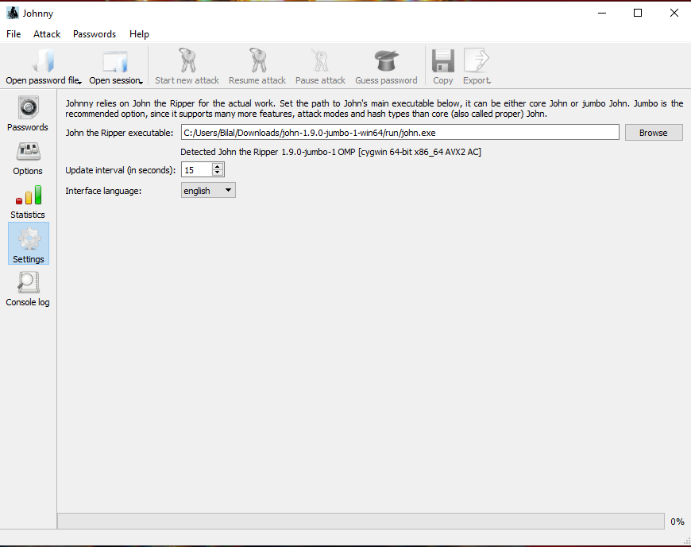
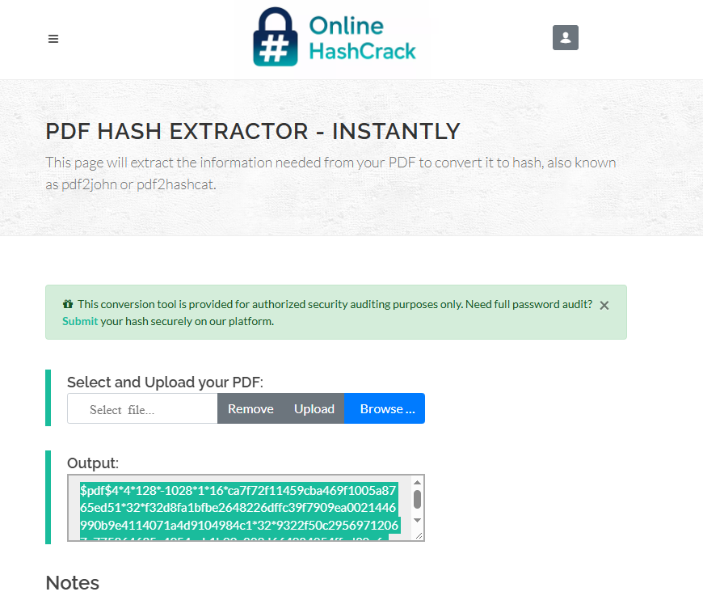
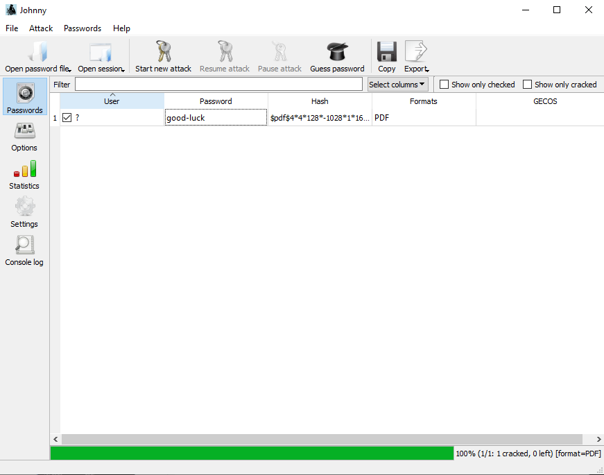
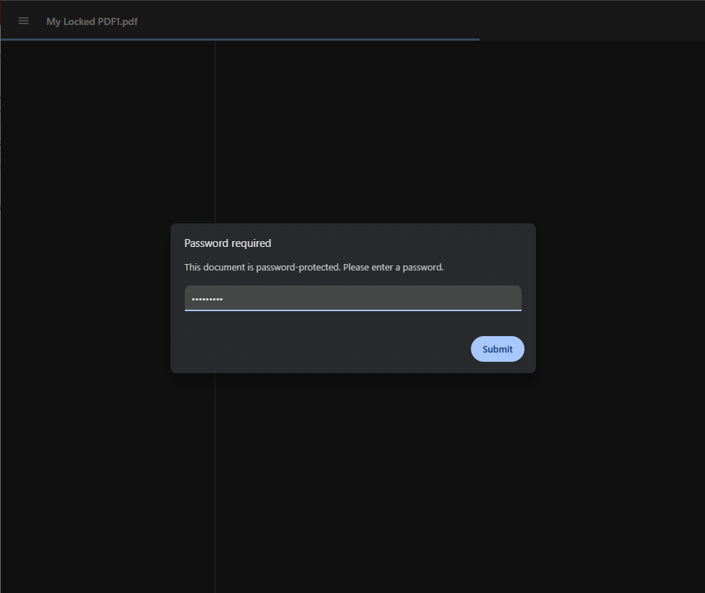
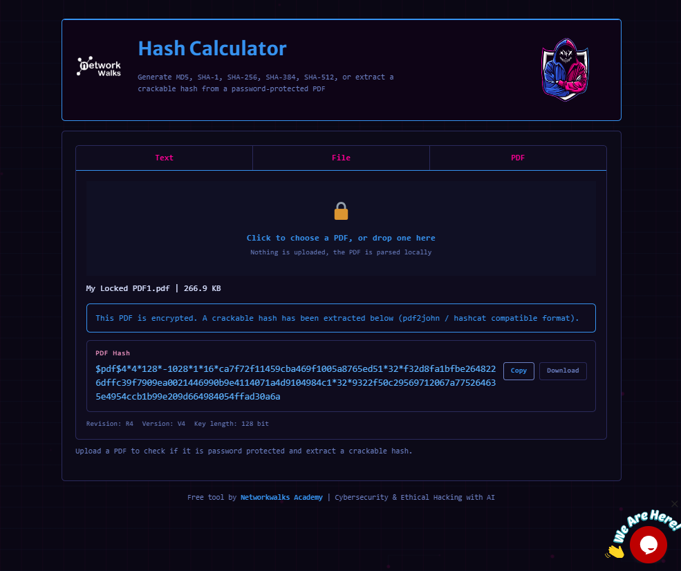
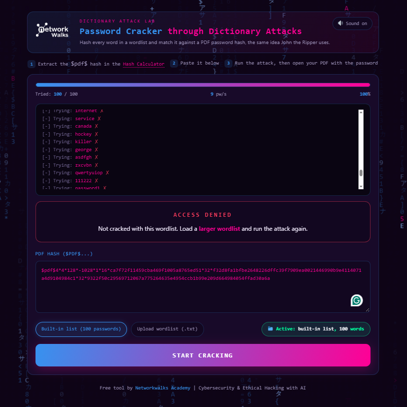
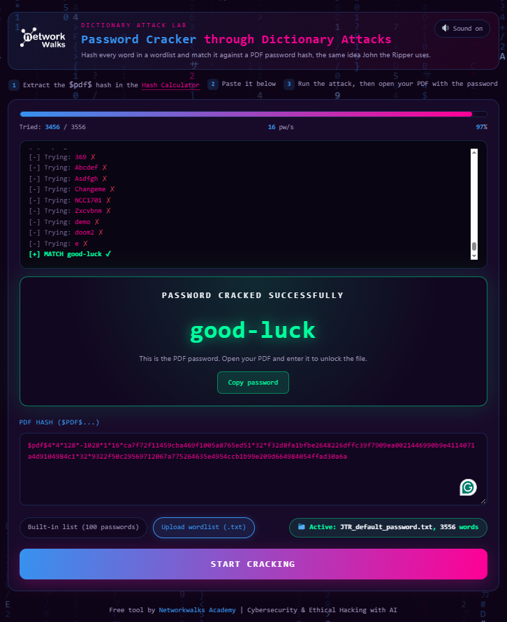

# 🔐 Week 3 — PDF Password Cracking Lab

**Extracting and cracking a password-protected PDF hash using John the Ripper and Networkwalks tools**

---

## 📌 Project Overview

This project documents **Week 3** of my Cybersecurity Internship, focused on password recovery from a password-protected PDF file in an authorized lab environment.

The lab was completed in two parts:

1. **John the Ripper (JTR) with the Johnny GUI** — a locally installed password-cracking workflow.
2. **Networkwalks Hash Calculator and Password Cracker** — a browser-based alternative workflow.

The exercise was performed only on the internship-provided locked PDF file, for educational and authorized training purposes.

---

## 🎯 Objectives

- Understand how password-protected PDF files store password-related information.
- Extract a `$pdf$...` hash from the encrypted PDF.
- Configure and use John the Ripper on Windows via the Johnny GUI.
- Use the Networkwalks Hash Calculator to generate a PDF hash.
- Use the Networkwalks Password Cracker to recover the password.
- Compare a local, tool-based workflow with a browser-based workflow.
- Verify the recovered password by successfully opening the protected PDF.
- Document the complete process, including any issues encountered.

---

## 🛠️ Tools Used

| Tool | Purpose |
|------|---------|
| John the Ripper (JTR) | Local password-cracking engine |
| Johnny GUI | Graphical interface for John the Ripper |
| [Networkwalks Hash Calculator](https://networkwalks.com/hash-calculator/) | Browser-based PDF hash generation |
| [Networkwalks Password Cracker](https://networkwalks.com/password-cracker/) | Browser-based password recovery |
| Locked PDF file | Target file for the exercise |

---

# 🪜 Part 1 — John the Ripper (JTR) + Johnny

## Step 1. Configure John the Ripper

`john.exe`, located inside the `run` folder, was selected and configured within the Johnny GUI settings.

---

## Step 2. Extract the PDF Hash

The encrypted PDF was processed to extract its password hash in the `$pdf$...` format, which John the Ripper uses to test password candidates.

---

## Step 3. Crack the Password

The extracted hash was loaded into John the Ripper through Johnny. John tested password candidates until a match was found.

---

## Step 4. Verify the Recovered Password

The recovered password was entered into the protected PDF, which opened successfully — confirming the password was correct.

Successfully Opened:

---

# 🪜 Part 2 — Networkwalks Hash Calculator & Password Cracker

## Step 5. Generate the Hash Using Networkwalks Hash Calculator

The encrypted PDF was uploaded to the [Networkwalks Hash Calculator](https://networkwalks.com/hash-calculator/), which processed the file and generated a `$pdf$...` hash.

---

## Step 6. First Attempt — Default Wordlist

The generated hash was tested using the [Networkwalks Password Cracker](https://networkwalks.com/password-cracker/) with its **default wordlist**, but the password was **not found**.

---

## Step 7. Second Attempt — Custom Wordlist

Since the default wordlist did not contain the correct password, a **custom wordlist was uploaded** to the Password Cracker. This attempt successfully recovered the password.

---

## Step 8. Verify the Password

The password recovered from the custom wordlist was entered into the PDF, which opened successfully — confirming the second attempt was correct.

---

# 🔍 Comparison of the Two Methods

| Method | Hash Generation | Cracking Tool | Wordlist Used | Result |
|---|---|---|---|---|
| John the Ripper + Johnny | Extracted locally | John the Ripper | Default JTR wordlist | ✅ Password recovered on first attempt |
| Networkwalks Tools | [Hash Calculator](https://networkwalks.com/hash-calculator/) | [Password Cracker](https://networkwalks.com/password-cracker/) | Default (failed) → Custom wordlist | ✅ Password recovered after uploading a custom wordlist |

Both workflows followed the same fundamental process:

**PDF → Hash → Password Cracking → Recovered Password → PDF Access**

---

# 🐞 Problems Encountered & Solutions

## Problem 1: Default wordlist failed to crack the password

Using the [Networkwalks Password Cracker](https://networkwalks.com/password-cracker/) with its built-in default wordlist did not recover the PDF's password.

**Cause:** The actual password was not present in the default wordlist provided by the tool.

**Fix:**
1. Sourced/prepared a custom wordlist likely to contain the target password.
2. Uploaded the custom wordlist to the Networkwalks Password Cracker.
3. The tool successfully matched the password on this second attempt.

This highlighted that password-cracking success is highly dependent on wordlist quality and coverage, not just the tool itself.

---

# 🧠 Key Concepts Learned

### 🔹 PDF Hash Extraction
A password-protected PDF can be processed to extract a `$pdf$`-format hash, which cracking tools use to test password candidates without needing the actual PDF encryption key directly.

### 🔹 Password Cracking & Wordlists
A cracking tool is only as effective as the wordlist behind it — a default/common wordlist can fail even when the tool itself works correctly, as seen in Part 2 of this lab.

### 🔹 John the Ripper
A password-security auditing and recovery tool, used here through the Johnny graphical interface on Windows.

### 🔹 Browser-Based Password Cracking
[Networkwalks' tools](https://networkwalks.com/) offer a browser-based alternative to a locally configured tool like John the Ripper, without needing local setup.

---

# ✅ Results

**John the Ripper Workflow**
- ✅ Configured John the Ripper via Johnny GUI
- ✅ Extracted the PDF hash
- ✅ Recovered the password using the default wordlist
- ✅ Verified by successfully opening the PDF

**Networkwalks Workflow**
- ✅ Generated the PDF hash via the Hash Calculator
- ⚠️ Default wordlist attempt failed to recover the password
- ✅ Password recovered after uploading a custom wordlist
- ✅ Verified by successfully opening the PDF

---

# 📚 Skills Demonstrated

- 🔐 Password Security
- 🔎 Hash Analysis
- 💻 John the Ripper
- 🖥️ Johnny GUI
- 🌐 Web-Based Security Tools
- 📄 PDF Security
- 🔑 Password Recovery & Wordlist Strategy
- 🧪 Security Lab Documentation

---

# 🔐 Security & Ethical Use

Password-cracking tools were used only in an authorized cybersecurity internship lab exercise, on a provided PDF file. This lab is intended strictly for educational and authorized testing purposes.

---

# 🔗 Tools & Resources

- **John the Ripper:** https://www.openwall.com/john/
- **Johnny GUI:** https://openwall.info/wiki/john/johnny
- **Networkwalks Hash Calculator:** https://networkwalks.com/hash-calculator/
- **Networkwalks Password Cracker:** https://networkwalks.com/password-cracker/

---

# 👤 Author

**Bilal Ashfaq**

`Computer Science Student | Cybersecurity & Networking Enthusiast`

LinkedIn: https://www.linkedin.com/in/bilal-siddiqui-61562a333/# 

NETWORKWALKS-B083-WK3-PM1-PM2-CRACKING-PASSWORD-USING-NW-TOOLS
